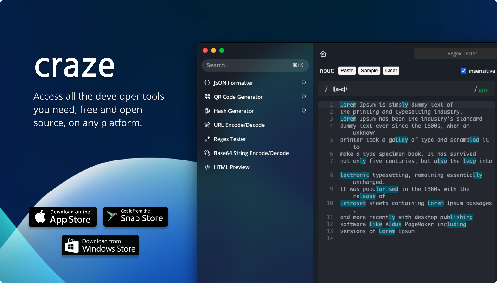

# Craze - Developer Tools


> Access all the developer tools you need, free and open source, on any platform!




## 🚀 Contributing

We welcome contributions to this project! If you're interested in contributing, please take a look at our [CONTRIBUTING.md](./docs/CONTRIBUTING-en.md) file for more information. We also have separate contributing guidelines available in other languages:
- [Turkish](./docs/CONTRIBUTING-tr.md)

Thanks for considering a contribution to this project! ⭐️

## 🛫 Development
After installing yarn, you can download dependencies and run the app with the commands below.

```sh
# install dependencies
yarn

# run application with hot reload
yarn dev
```

## 🧪 Testing
You can use the following command to run all the tests written with Jest in the project: 

This command will run all the tests in the project and display the test results in the terminal.

```sh
yarn test
```

## 🛠 Build
You can build the application for different platforms by using the following commands:
```sh
# for linux
yarn build:linux

# for macos
yarn build:macos

# for windows
yarn build:win
```

These commands will create the executable files for the corresponding platform in the project's `dist` folder.

